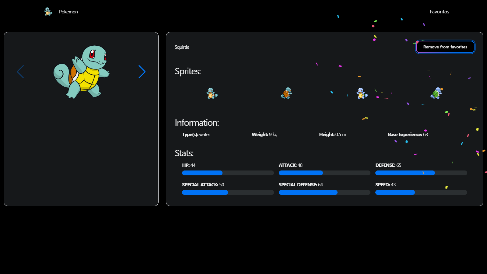

# Next.js Pokémon App - Favorite Pokémon Manager

This project is a web application developed in Next.js that allows users to search for Pokémon, view individual details, and add their favorite Pokémon to a personalized list. It utilizes the [PokeAPI](https://pokeapi.co/) to obtain detailed information about each Pokémon, employing a Static Site Generation (SSG) approach and dynamic routes to optimize performance.

## 🌐 Access the Application

You can access the production application at the following link: [PokeFavorites](https://pokefavorites.vercel.app/)

## Screenshots

Here are some screenshots of the application:

  
_Main page showing the list of Pokémon._

  
_Details page of a specific Pokémon._

  
_Page showing the user's favorite Pokémon._

## Technologies Used

- **[Next.js](https://nextjs.org/) (v13.1.1)**: React framework for web applications.
- **[React](https://reactjs.org/) (v18.2.0)**: Library for building user interfaces.
- **[@nextui-org/react](https://nextui.org/)**: UI component library.
- **[Axios](https://axios-http.com/)**: HTTP client for making requests to the PokeAPI.

## Features

1. **Pokémon List**: Displays the first 151 Pokémon from the first generation. Each Pokémon in the list includes an image and its name. Clicking on a Pokémon navigates to a details page.

2. **Pokémon Details Page**:

   - Detailed information about each Pokémon, including sprites from different poses and versions.
   - Favorite button to add/remove the Pokémon from the favorites list.
   - Confetti visual effect when adding a Pokémon to favorites.

3. **Favorites Page**: Displays all the Pokémon that the user has added to favorites. Allows users to remove Pokémon from the favorites list from this view.

4. **Dynamic Routes**:
   - Access Pokémon details by **name** (`/name/[pokemon_name]`) and by **ID** (`/pokemon/[id]`).
   - Redirects to a custom error page if the Pokémon does not exist.

## Application Structure

- **`/pages/index.tsx`**: Main page, shows the list of Pokémon. Uses SSG to optimize performance when loading the list.
- **`/pages/pokemon/[id].tsx`** and **`/pages/name/[name].tsx`**: Pokémon details pages, accessible by ID or name. Implements SSG with dynamic routes and daily updates to keep the information current.
- **`/pages/favorites/index.tsx`**: Favorites page, shows the Pokémon that the user has selected as favorites.

## Integration with PokeAPI

This application connects to the PokeAPI to obtain detailed data about Pokémon, such as names, types, abilities, and sprites. Thanks to this integration, the application can display updated information about each Pokémon and provide an interactive and dynamic experience for users.

## 🚀 Installation

1. Clone the repository:

   ```bash
   git clone https://github.com/Jonlle/next-pokemon-static.git
   cd next-pokemon-static
   ```

2. Install the dependencies:

   ```bash
   npm install
   ```

3. Start the development server:

   ```bash
   npm run dev
   ```

4. Open [http://localhost:3000](http://localhost:3000) in your browser to view the application.

## Contribution

Contributions are welcome! If you would like to contribute to this project, please follow these steps:

1. Fork the project.
2. Create a new branch (`git checkout -b feature/new-feature`).
3. Make your changes and commit (`git commit -m 'Add new feature'`).
4. Push your changes to your fork (`git push origin feature/new-feature`).
5. Open a Pull Request.
